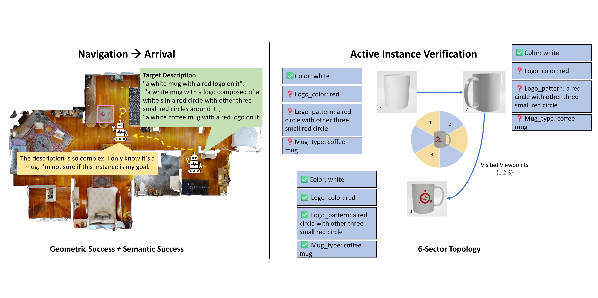
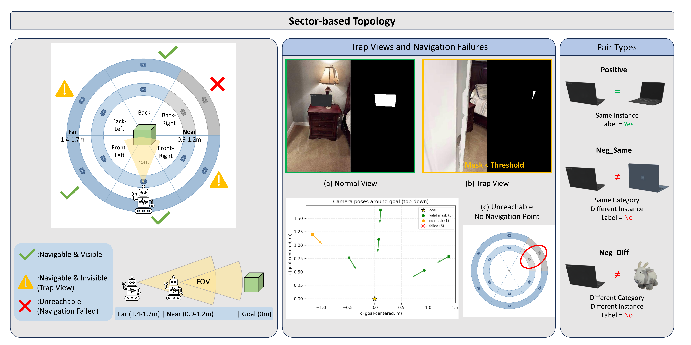
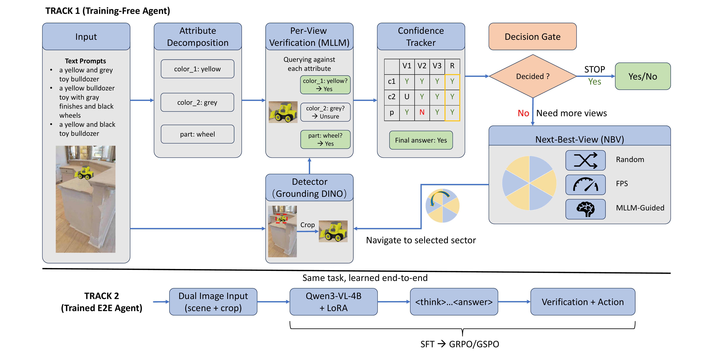

# PInVerify: An Offline Embodied Benchmark for Active Instance Verification

**English** &middot; [简体中文](README_zh.md)

[](https://arxiv.org/abs/2605.30639)
[](https://avalon-s.github.io/PInVerify)
[](https://huggingface.co/datasets/Avalon-S/PInVerify)
[](https://huggingface.co/Avalon-S/PInVerify-Qwen3VL-4B)
[](LICENSE)
[](https://foundation-models-meet-embodied-agents.github.io/cvpr2026/)

Official repository for the FMEA @ CVPR 2026 paper
**"PInVerify: An Offline Embodied Benchmark for Active Instance Verification."**

Navigation gets an agent to the right *category*. Telling two backpacks apart is a different problem, and it is the one this benchmark isolates: the agent has already arrived next to a candidate, and now has to work out, by choosing where to look from, whether this is the object the description meant.

That task is **Active Instance Verification (AIV)**. The benchmark holds 3,000 episodes on a six-sector viewpoint topology. Training-free and LoRA-fine-tuned MLLM agents ship as reference implementations.

<p align="center">
  
</p>

## The setup

Each episode places the target inside a ring of pre-rendered viewpoints: six
angular sectors on a far and a near ring. The agent picks where to look next,
one step at a time, under a six-step budget. Two things can go wrong that have
nothing to do with recognition: a sector may be unreachable, or reachable but
useless because the target is barely visible from it. The benchmark scores both
as navigation failures rather than hiding them.

<p align="center">
  
</p>

The reference agent works attribute by attribute. It splits the description,
checks each attribute against the current view, and keeps a tracker that
reconciles what different views disagree on. Once the tracker has converged it
stops, instead of spending the rest of the budget.

<p align="center">
  
</p>

## What is where

The project ships in three branches. They hold different codebases with
**mutually incompatible Python environments**, which is why they are separate
branches rather than directories: one checkout maps to one conda environment,
so nothing gets installed on top of the wrong stack.

| Branch | Contents | Environment |
|---|---|---|
| **`main`** (you are here) | The benchmark: environment, training-free and trained agents, evaluation harness, every config behind the paper's tables | Python 3.10, torch 2.1.2+cu118, transformers 4.52.4, numpy 1.26 |
| **`data-collection`** | The capture pipeline that built the benchmark from PInNED, specified in Appendix A of the paper: object injection, 6-sector viewpoint capture, mask and reachability annotation, the iterative repair loop, and the render audit of Appendix A.10 | Python 3.9, torch 1.13.1+cu117, habitat 0.2.3, pytorch3d, transformers 4.38.2, numpy 1.23 |
| **`benchmark-fix`** | Defects found in the upstream PIN benchmark while building this dataset, and the code that detects and repairs them: object penetration, floor-height errors, abnormal-episode triage, goal-view scoring. **Not part of the paper**, so do not look for a corresponding section | Same habitat stack as `data-collection` |

The conflicts are hard ones: torch 1.13 against 2.1 on different CUDA builds
(cu117 vs cu118), numpy 1.23 against 1.26, and transformers 4.38 against 4.52,
which Qwen3-VL requires. Keep one conda environment per branch.

Fine-tuning lives in `main` under [`training/`](training/), next to the agents
it trains; it runs in the `main` environment plus `ms-swift`.

```bash
git clone https://github.com/Avalon-S/PInVerify.git
cd PInVerify
git checkout data-collection    # or: benchmark-fix
```

`benchmark-fix` is a side product rather than a contribution the paper claims.
It ships the detection and repair code, not repaired data: PIN's original data
is public, so the pipeline can be re-run against it.

## Data and weights

The code is in this repository. Everything it consumes or produces is on the
Hub, and all of it is public.

| Repository | Contents |
|---|---|
| [`Avalon-S/PInVerify`](https://huggingface.co/datasets/Avalon-S/PInVerify) | The test split with all six indices, the SFT and RL training pools with their crops, and the description and attribute caches |
| [`Avalon-S/PInVerify-Qwen3VL-4B`](https://huggingface.co/Avalon-S/PInVerify-Qwen3VL-4B) | All eight LoRA adapters, by subdirectory. Each keeps its `args.json` and `trainer_state.json`, so the run configuration and the loss curve come with it |

[`scripts/prepare_hf_release.py`](scripts/prepare_hf_release.py) is what pushed
both, and it verifies a dataset tree before uploading it, so it doubles as a way
to check a local copy.

The code is released as-is from the machine that produced the paper's numbers.
It has not been re-run end to end in a clean environment, so expect to adjust
paths and server ports for your own setup.

---

## Repository Structure

```
PInVerify/
├── pver/                 Core package: env, policies, tracker, fusion, NBV, eval, viz
├── configs/
│   ├── agent/            25 agent configs + README mapping each paper table to a config
│   └── prompts/          10 prompt templates (extract / verify / category / merge / nav)
├── scripts/              Evaluation entry points, cache builders, figure scripts, HF release
├── training/             SFT + DPO/GRPO/GSPO data prep and training shells
├── servers/              VLM / detector servers (Qwen3-VL, Grounding DINO, CLIP, SenseNova-SI)
├── data/examples/        Tiny episode samples for sanity checks
├── docs/                 INSTALL / DATASET / EVALUATION / TRAINING / ARCHITECTURE
├── hf_cards/             Hugging Face dataset + model cards, and the upload recipe
├── project-page/         Static project website (auto-deployed to GitHub Pages)
├── run_all.sh            Training-free evaluation runner (reproduces Tables 4 and 5)
├── runner.py             Batch evaluation harness
└── AGENTS.md             Notes for coding agents: the traps that break results quietly
```

Paths in the configs assume the dataset at `./data/pv_dataset` and model weights at `./models/<name>`. Both can be overridden per run on the command line.

---

## Quick Start

### 1. Install

```bash
git clone https://github.com/Avalon-S/PInVerify.git
cd PInVerify

conda create -n pv_bench python=3.10 -y
conda activate pv_bench
pip install -r requirements.txt --extra-index-url https://download.pytorch.org/whl/cu118
```

That covers the Qwen3-VL agents and the embedding baselines. Three pieces are
installed separately, and **[docs/INSTALL.md](docs/INSTALL.md) has the full
procedure**, including the CUDA-version constraint that trips up the first one:

- **Grounding DINO**, needed for `method.bbox_mode=dino` (the main tables). It compiles a CUDA extension that must match torch's CUDA build, and `servers/run_groundingdino_server.py` runs from inside its checkout.
- **SenseNova-SI**, only for one row of Table 5. It needs its own `sensenova` environment (Python 3.11, torch 2.5.1+cu121, numpy 2.x), which cannot coexist with `pv_bench`.
- **ms-swift**, only if you re-train. It needs a newer transformers than `requirements.txt` pins, so it goes in a separate `pv_train` environment (torch 2.2.0, transformers 4.57.0). Adapters are still *evaluated* in `pv_bench`.

### 2. Download the dataset

```bash
huggingface-cli download Avalon-S/PInVerify --repo-type dataset \
    --local-dir ./data/pv_dataset
```

Evaluation needs nothing further. To train, unpack the two pools first:

```bash
cd ./data/pv_dataset/pin_capture
for pool in train_sft train_rl; do
    (cd $pool && for f in *.tar; do tar -xf "$f" && rm "$f"; done)
done
```

Layout:

```
data/pv_dataset/
├── pin_capture/
│   ├── val/<scene>/<episode>/{meta.json, rgb/, mask/, overview.png}
│   ├── train_sft/<scene>.tar   one archive per scene, unpack in place
│   └── train_rl/<scene>.tar
├── image_gt/<category>/       Ground-truth bounding-box masks
├── val/pv_index_{50,100,500,1000,all,all_7455}.jsonl
├── train_sft/{pv_train_sft_index.jsonl, sft_data_v2.jsonl, sft_data_v3.jsonl, crops/, crops_v3/}
├── train_rl/{pv_train_rl_index.jsonl, rl_data_v2.jsonl, dpo_data_v3.jsonl, crops_rl/, crops_dpo/}
├── attr_cache.json
├── category_cache.json
├── merge_cache.json
└── object_descriptions_with_category.json
```

`pv_index_all.jsonl` is the 3,000-pair test split behind every number in the
paper. `pv_index_all_7455.jsonl` is the full pair set over the same captures; it
runs the same way and costs about two and a half times as much, which is why the
paper does not report it. See [docs/DATASET.md](docs/DATASET.md) for the full spec.

The training pools were sampled from a larger capture pool that is not published.
Nothing in the paper uses more than what is here; if you need the larger pool,
open an issue.

To check a local copy, or to republish from a machine that holds the captures:

```bash
python scripts/prepare_hf_release.py check  --data-root <dataset root>
python scripts/prepare_hf_release.py upload --data-root <dataset root> \
    --repo Avalon-S/PInVerify --card hf_cards/dataset_card.md
```

`check` walks every split index and refuses to publish a partial copy.

### 3. (Optional) Download trained checkpoints

Every adapter the paper reports lives in one model repository,
`Avalon-S/PInVerify-Qwen3VL-4B`, under subdirectories. Overall accuracy on the
3,000-episode test split, positive-pair accuracy in parentheses:

| Adapter | DINO | GT |
|---|---|---|
| *(base model, no fine-tuning)* | 0.706 (0.146) | 0.710 (0.161) |
| `generic-cot/sft` | 0.848 (0.759) | 0.877 (0.828) |
| `generic-cot/grpo` | 0.853 (0.736) | 0.887 (0.806) |
| **`generic-cot/gspo`** | **0.856** (0.745) | **0.889** (0.813) |
| `specific-cot/sft` | 0.858 (0.697) | 0.884 (0.761) |
| `specific-cot/dpo-200` | 0.859 (0.700) | 0.881 (0.756) |
| `specific-cot/dpo-400` | 0.860 (0.665) | 0.884 (0.729) |
| `specific-cot/grpo` | 0.855 (0.793) | 0.884 (0.847) |
| `specific-cot/gspo` | 0.851 (0.796) | 0.889 (0.813) |

`generic-cot/*` is the paper's main table (Table 6); `specific-cot/*` is the
Appendix F variant, differing only in how the SFT chain-of-thought was written.
`generic-cot/gspo` is the headline result. The 95% CI is about ±1.3 pp, so most
differences between fine-tuned variants are within noise; the gap that matters is
against the un-tuned base model, which nearly always answers "no match".

```bash
huggingface-cli download Avalon-S/PInVerify-Qwen3VL-4B \
    --include "generic-cot/gspo/*" --local-dir ./models/pinverify
```

### 4. Run one configuration on the 50-episode smoke split

```bash
# Start a single Qwen3-VL-4B server (one GPU).
# The model path is the MODEL_PATH constant at the top of the script; the
# batched server used by the multi-GPU launchers takes --model instead.
python servers/run_qwen3_server.py --port 12182

# In another shell: run MV-Attr+LLM-NBV on 50 episodes with GT boxes
python scripts/evaluate.py \
  --config configs/agent/multi_view_attr_adaptive_llm.yaml \
  dataset.index_file=pv_index_50.jsonl \
  method.bbox_mode=gt
```

`method.bbox_mode=dino` additionally needs a Grounding DINO server on port 12183, started from inside a GroundingDINO checkout with `servers/run_groundingdino_server.py` (setup steps are in that file's docstring).

Results land in `./outputs/<run_name>/metrics.json`.

---

## Reproducing the Paper Results

Reproduction needs the dataset, and the trained-agent table also needs the model weights, so it is blocked until both are published. The commands below are the intended entry points.

Which config produces which table row is documented in **[configs/agent/README.md](configs/agent/README.md)**, together with the expected accuracy for each row.

### Table 4: training-free main table

```bash
# 4-GPU dynamic evaluation over the 9 training-free configs, DINO detection
bash scripts/start_multigpu_servers.sh 4
bash run_all.sh                      # full 3,000-episode split
bash run_all.sh 50                   # smoke split

BBOX_MODES=gt bash run_all.sh        # the GT-box ablations of Sec. 6.4
```

Aggregation (`compare_metrics.py` takes the directories as positional arguments):

```bash
python scripts/summarize_all_agents.py --output_base ./outputs/main_all
python scripts/compare_metrics.py ./outputs/main_all --breakdown
python scripts/compare_metrics.py ./outputs/main_all --csv table4.csv
```

### Table 5: cross-model comparison

```bash
# CLIP / SigLIP2 embedding baselines (plus the appendix sweep)
AGENT_SET=embedding bash run_all.sh

# Qwen3-VL-8B: same configs, server pointed at the 8B weights
# SenseNova-SI: bash scripts/start_multigpu_servers_sensenova.sh 4
```

### Table 6: trained agents

```bash
# Re-train (skip if using released checkpoints)
bash training/run_sft.sh             # Generic-CoT SFT, the paper's main rows
bash training/run_gspo.sh            # SFT + GSPO, the headline result

# Evaluate a trained adapter
ADAPTER=./outputs/training/gspo_v2_from_sft bash scripts/start_multigpu_servers_lora.sh 4
bash scripts/eval_trained.sh gspo_v2
```

The `*_v3.sh` scripts train the Specific-CoT variant reported in Appendix F. See [docs/TRAINING.md](docs/TRAINING.md) for the difference.

### Paper figures

These scripts read run outputs from paths hardcoded at the top of each file
(`./outputs/qwen3_vl_4b/...` for training-free runs, `./outputs/trained/...` for
trained ones). Either edit those constants, or produce the runs where the
scripts expect them:

```bash
OUT_BASE=./outputs/qwen3_vl_4b SAVE_VIZ=true bash run_all.sh
```

`SAVE_VIZ=true` writes a per-episode `episode.json`, which the NBV and case-study
plots parse. It costs disk but changes no metric.

```bash
python scripts/plot_per_category.py        # per-category accuracy (reads metrics.json)
python scripts/plot_nbv_polar_dino.py      # NBV direction polar plots (reads episode.json)
python scripts/plot_case_study.py          # qualitative case studies (reads one episode.json)
python scripts/plot_dataset_overview.py    # dataset statistics (reads the dataset directly)
```


See [docs/EVALUATION.md](docs/EVALUATION.md) and [docs/TRAINING.md](docs/TRAINING.md) for the full reproduction guide.

---

## Citation

```bibtex
@misc{jiang2026pinverifyofflineembodiedbenchmark,
      title={PInVerify: An Offline Embodied Benchmark for Active Instance Verification},
      author={Yuhang Jiang},
      year={2026},
      eprint={2605.30639},
      archivePrefix={arXiv},
      primaryClass={cs.CV},
      url={https://arxiv.org/abs/2605.30639},
}
```

---

## Acknowledgements

PInVerify is built on top of [PInNED (Barsellotti et al., NeurIPS 2024)](https://arxiv.org/abs/2410.18195) for the HM3D scenes, Objaverse-XL object pool, and instance descriptions. We thank the authors for releasing their work.

## License

Released under the [MIT License](LICENSE). The benchmark data inherits PInNED's terms; please consult its license for dataset-use conditions.
