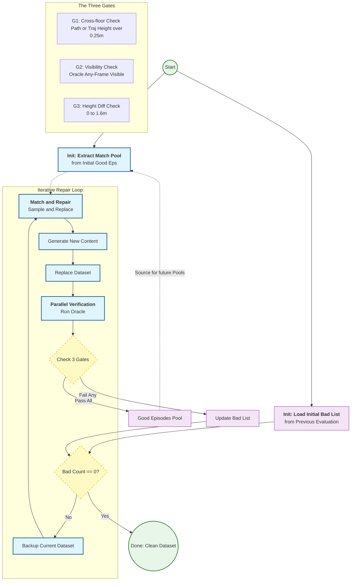

# PIN-v2 dataset repair and cleaning workflow

## 1. Overview

Building a high-quality goal-navigation dataset from the HM3D-based PIN episodes
meant finding and fixing samples that are physically impossible, visually
impossible, or that require navigating across floors. This is the automated
closed-loop repair pipeline that does it.

The loop is **verify, identify, repair, replace**, run until no abnormal sample
remains.

### The steps

1. **Parallel verification.** An oracle agent runs every episode in Habitat
   across several workers, measuring physical and visual quantities as it goes.
2. **Abnormal identification.** Three gates decide whether an episode is
   acceptable.
3. **Match pool extraction.** Verified good episodes contribute their
   (start, goal) pairs to a candidate pool.
4. **Iterative repair.** For each bad episode, the object category and scene id
   stay fixed while a new, already-verified (start, goal) pair is sampled from
   the pool. The result is written as a new dataset revision.
5. **Loop regression.** The repaired dataset is verified again, since a
   substituted pair still has to hold up under the current configuration.
   Whatever fails goes into the next round.

---

## 2. The three gates

An episode is good only if it passes all three.

### Gate 1: cross-floor and stairs

**Goal:** drop anything that navigates between floors or up stairs. PIN is
defined as single-floor navigation.

Two independent checks, and either one is enough to fail:

1. **OVON path height.** Take the shortest path the oracle plans on the navmesh
   and measure the height spread of its waypoints.
2. **Trajectory height.** Record the agent's position at every executed step and
   measure the height spread of the walked path.

Threshold: `path height range > 0.25 m` **or** `trajectory height range > 0.25 m`
sets `is_cross_floor = True`, which fails the gate.

The two checks are not redundant. The path check catches a plan that goes
upstairs; the trajectory check catches an agent that wandered onto a staircase
the plan did not anticipate.

### Gate 2: physical visibility

**Goal:** make sure the target can actually be seen, ruling out objects that are
too small, occluded, or tucked into a dead angle.

The oracle navigates the shortest path while the semantic mask is checked on
every frame. If the target's mask clears the visibility threshold in **any**
frame along the route, the gate passes.

An episode where the mask never appears (`episode_mask_visible = False`) fails.

### Gate 3: start-goal height consistency

**Goal:** rule out targets floating in the air or buried below the floor.

Compute `diff = goal.y - agent.y` at the agent's final position.

Acceptable range: `0.0 m <= diff <= 1.6 m`.

- `diff > 1.6 m` fails: the target is too high to be reachable, usually floating.
- `diff < 0.0 m` fails: the target sits below the agent, which normally means it
  is under the floor or on the level below.

---

## 3. Repair strategy

**Distribution-preserving replacement.** Repair is not a blunt swap of start and
goal. The configuration is migrated piece by piece so the task keeps its semantic
character:

- **Object category and scene id** never change.
- **Distractor configuration**, which is the delicate part:
  - *Identity*: the categories and object ids of the original episode's
    distractors are kept, so the scene's semantic composition is unchanged.
  - *Geometry*: their possibly-illegal positions are discarded in favour of
    verified-legal positions and poses sampled from a good episode in the pool.
  - *Result*: the repaired episode holds exactly the same object list as before,
    placed at new, physically feasible positions.

**Stochastic sampling.** Replacements are drawn at random from the pool, so a
failed repair is likely to draw a different candidate next round rather than
deadlocking on the same bad choice.

**Convergence.** On the training split:

| Round | Bad in | Repaired |
|---|---|---|
| 1 | 232,740 | 226,220 |
| 2 | 6,520 | 6,225 |
| ... | ... | ... |
| N | 0 | |

The loop terminates at zero bad episodes.

---

## 4. Workflow diagram

